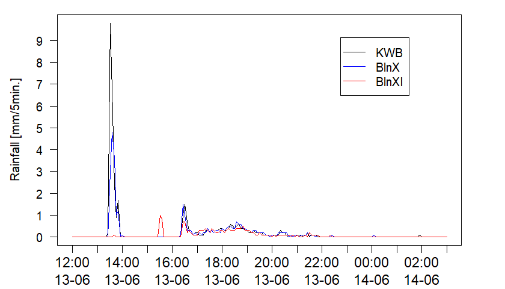

# Introduction

A series of functions for collecting hydrological and weather data from different sources.

The functions can be loaded with `source()`:
```R
source('.../stormRunoff.R')
source('.../weather.R')
```

# Read runoff data from tipping bucket runoff loggers
Data from tipping bucket runoff loggers can be read using function `readTipbucket`:
```R
# read data from runoff logger
runoff <- readTipbucket(rawdir='..../runoff_logger_data/', dateFormat='%Y-%m-%d %H:%M:%S', timeZone='Etc/GMT-1')
```					 
Parameters:
- `rawdir`: Directory containing raw data files
- `dateFormat`: Date and time format in the raw data
- `timeZone`: Time zone of time stamps in the raw data

If there are different data files covering different overlapping or non-overlapping time periods (e.g., file 1: 1-Jan-2020 to 15-Jun-2020, file 2: 1-Jun-2020 to 10-Oct-2020, file 3: 15-Nov-2020 to 31-Dec-2020, etc.), the function automatically generates a single time series, filling gaps with `NA`

# Fetch rainfall station data from in-house and external server
Function `updateRainDB` fetches rainfall data for a selected time period from an in-house and an external server and adds it to a local data base (plain text file). As a first step, the user must manually create an NA-filled data base covering the project's time period as template. Format:

| dateTime         | gauge1 | gauge2 | gauge3 | ... | 
| ---------------- | ----   | ----   | -----  | --- |
| 2019-10-15-19:00 | NA     | NA     | NA     | NA  |
| 2019-10-15-19:05 | NA     | NA     | NA     | NA  |
| 2019-10-15-19:10 | NA     | NA     | NA     | NA  |
| 2019-10-15-19:15 | NA     | NA     | NA     | NA  |
| 2019-10-15-19:20 | NA     | NA     | NA     | NA  |
| ...              | ...    | ...    | ...    | ... |

Time stamps must be in the first column, with column name `dateTime`.Date and time format must be as shwon here. `gaugeX` stands for the names of the gauges as they are in the respective servers. The function will read this template and determine from it the names of the gauges and the time period of the project.

`updateRainDB` fetches the new data and overwrites the rows corresponding to the time period between `tBeg` and `tEnd` (inclusive). Function usage:
```R
updateRainDB(rawdir='.../rainfall_db/',
             rainDBname='rainDB.txt',
             tBeg='20200623',
             tEnd='20200623',
             tFalseRainName='tFalseRain.txt',
             login='xxxxx:xxxx',
             D2Wsid='xxxxxxx',
             skip="",
             overwriteOldDB=TRUE,
             summerTime=data.frame(year=c(2020, 2021), 
                                   start=c("29-Mrz-20 03:00:00 +0200", 
                                           "25-Okt-20 02:55:00 +0200"),
                                   end=c("28-Mrz-21 03:00:00 +0200", 
                                         "31-Okt-21 02:55:00 +0200")))
```
Parameters:
- `rawdir`: Directory containing the rainfall database
- `rainDBname`: Name of rainfall database
- `tBeg` and `tEnd`: Start and end dates of data to be fetched
- `tFalseRainName`: Name of file containing time stamps of manually adjusted data points. In this use case, the raw data may contain data points with false rain resulting from gauge maintenance. These data points are adjusted manually in the data base and their time stamps are registered in this file so that the function skips over them the next time a download occurrs. This avoids overwritting the corrected data.
- `login`: User name and password for the in-house server
- `D2Wsid`: Session ID for the external server
- `skip`: This parameter offers the possibility of skipping either server. `skip=BWB` skips external server, `skip=BWB` skips in-house server
- `overwriteOldDB`: If `TRUE`, overwrites the rows with the new data directly in the existing data base. If `FALSE`, generates a copy of the existing data base and overwrites the raws there. The copy will have the same name as the original data base with `_new` appended to it.
- `summerTime`: `data.frame` indicating the start and end (first and last time stamps) of the summer daylight saving time in the current use case. **Important:** the current version of the function was written for use in time zone `Etc/GMT-1` (Germany, no daylight saving time). Time zone will be added as a user-given parameter in future versions.

# Fetch weather station data from German Weather Service's Climate Data Centre
# https://opendata.dwd.de/climate_environment/CDC/
`updateWeatherDB` uses `download.file` to access the German Weather Service's Climate Data Centre and download the current contents (last 500 days) of `recent/10minutenwerte_XXXX_00`, where `XXXX` stands for the desired weather variable (see below). Downloaded data are added to a user-created plain text file, as done for `updateRainDB`.
Function usage for temperature data:
```R
updateWeatherDB(rawdir='.../weather_data/',
                dbName='tempDB.txt',
                dwdCols=c('MESS_DATUM', 'TT_10', 'RF_10', 'QN'),
                dwdStationID=430,
                overwriteOldDB=TRUE)
```

Parameters:
- `rawdir`: Directory containing the weather data bases
- `dbName`: Name of data base plain text file. In the example above the function will work on the temperature data base `tempDB.txt`.
- `dwdCols`: Names of the desired columns in the original DWD data. See DWD data set documentation.
`dwdStationID`: DWD station number
`overwriteOldDB`: If `FALSE`, creates a copy of the original data base and adds the downloaded data there, appending `_new` to the name. If `FALSE`, adds the downloaded data to the original data base.

# Load weather data base into R
`readWeatherDB` is a simple wrapper around `read.table` for reading the above weather data bases.

```R
rainData <- readWeatherDB(rawdir='.../weather_data/',
                          dbName='rainDB.txt',
                          naStrings=c('NA', '[-11059] No Good Data For Calculation'))
```

# Visualizing the data
`checkRain` allows plotting rainfall at multiple rain gauges for a selected time window:
```R
checkRain(rainData=rainData,
          gauges=c('KWB', 'BlnX', 'BlnXI'),
          col=c('black', 'blue', 'red'),
          lty=c(1, 1, 1),
          pch=c(NA, NA, NA),
          tBeg='2020-06-13 12:00',
          tEnd='2020-06-14 03:00',
          dt=1*3600,
          dy=1)
```


`checkWeather` creates a plot for visualizing rainfall, wind and temperature simultaneously
```R
checkWeather(tBeg='2020-06-13 12:00',
             tEnd='2020-06-14 03:00',
             dt=3600*1,
             rainData=rainData, 
             windData=windData, 
             tempData=tempData,
             rainScale=20,
             rainGauge='KWB')
```
Parameter rainScale controls the scaling of the rainfall data on the inverted axis at the top of the plot.


`plotEvent` graphs 
plotEvent(tBeg='2020-06-04 10:00',
          tEnd='2020-06-08 23:30',
          dt=3600*1,
          inflowQ=Qzu, outflowQ=Qab, rainData=rainData,
          rainGauge='KWB',
          rainScale=100)


